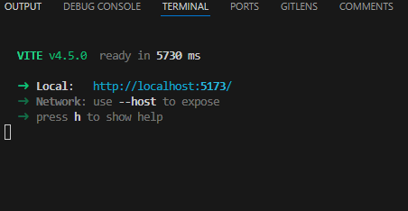

# EventTrakka
EventTrakka is a project created to help with event management and broadcasting in the EKITI Tech Ecosystem. Join OSCA Ado-Ekiti, SheCodeAfrica Ado-Ekiti, GDSC EKSU and GDSC FUOYE, GDSC BOUESTI, MSFT Community EKSU, MFST Fuoye, I4G FUOYE, WTM Ado-Ekiti, DSN EKSU and TheCompleteHub in completing this project we started in HacktoberFest 2023

EVENTTRAKKA is a web platform that will help with accessing details about Tech events across all Tech communities in Ekiti. In it working context, you can check for upcoming, past and live events happening at OSCA ADO-EKITI, GDSC EKSU, GDSC FUOYE, GDSC BOUESTI, She Code Africa Ado-Ekiti, WTM Ado-Ekiti, MLSA EKSU, GDG Ado-Ekiti, DSN EKSU and other Tech Communities all at once on _EVENTTRAKKA_ 


## How to start EventTrakka on your local machine for contribution
NOTE: You should have forked the repo, cloned the repo to your local machine.

1. Open Eventrakka in your code editor
2. Open the terminal and install packages ```yarn install```
3. After successfully install packages, use ```yarn dev``` to start the project.
EventTrakka is up 🎉🎉🎉 your terminal should look like this.




You can now access EventTrakka locally on ``` http://localhost:5173/```